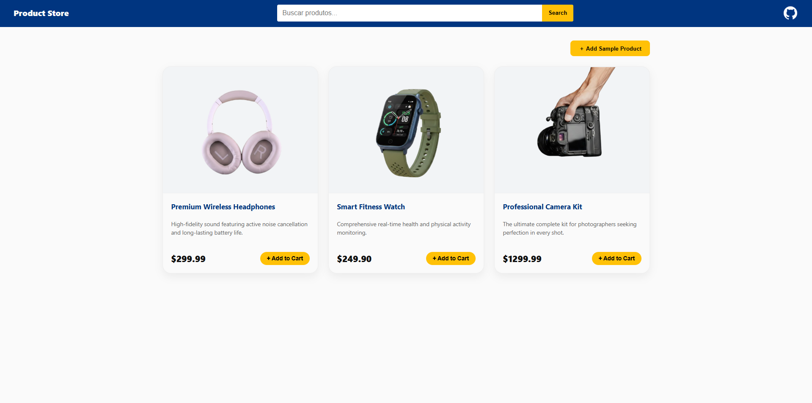

# acadia-frontend-dev - Frontend Assessment
Responsive product management dashboard built with JavaScript, focusing on performance, mobile-first design, and DOM manipulation.

## 🚀 Quick Start
1. Clone the repository:
git clone https://github.com/jessiicasantos/acadia-frontend-dev.git

2. Install dependencies:
> npm install

3. Run the project:
> npm run dev

> The project uses json-server to simulate a REST API for product persistence.

## 🛠 Tech Stack
+ HTML
+ CSS
+ JavaScript
+ Zod (client-side schema validation)
+ JSON Server (Mocking a backend environment)

## Live Demo
[https://acadia-frontend-jessica-santos-3d7b33444be3.herokuapp.com/](https://acadia-frontend-jessica-santos-3d7b33444be3.herokuapp.com/)

## 👤 Author
Jéssica Nascimento dos Santos